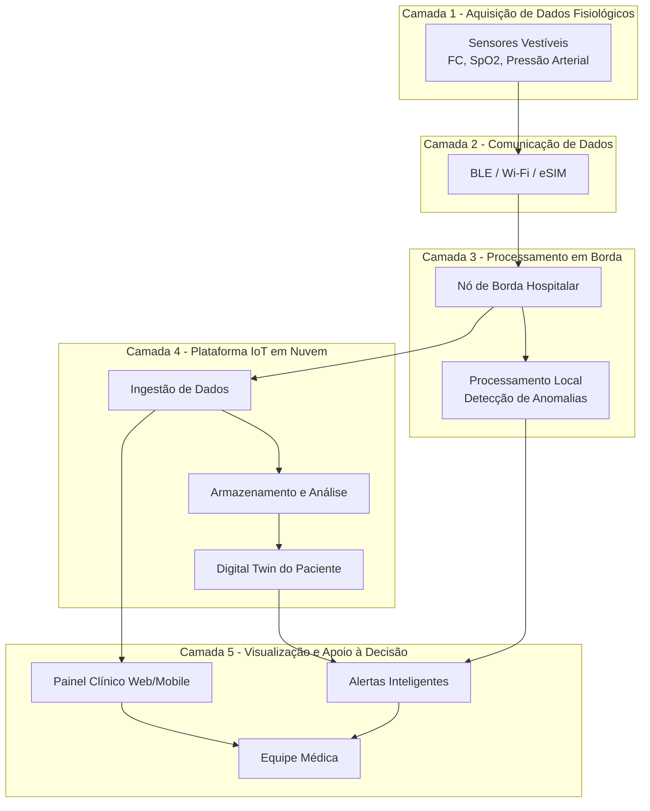
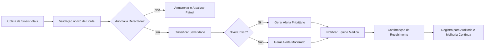

# Estudo de Caso – IoT na Saúde (Hospital Inteligente)

## 1. Introdução (versão preliminar)

A Internet das Coisas (IoT) tem promovido uma transformação significativa no setor da saúde, permitindo a conexão de dispositivos capazes de coletar, transmitir e analisar dados em tempo real. No contexto hospitalar, essa tecnologia viabiliza o monitoramento contínuo de pacientes, especialmente em unidades críticas, onde decisões rápidas podem impactar diretamente na sobrevivência dos indivíduos.

Nesse cenário, surge o conceito de Hospital Inteligente, no qual sensores, dispositivos vestíveis e plataformas digitais trabalham de forma integrada para aumentar a eficiência operacional e a qualidade do atendimento.

Este trabalho propõe uma solução baseada em IoT para monitoramento contínuo de pacientes críticos, com uso de sensores vestíveis, edge computing e plataformas de análise, visando melhorar a tomada de decisão clínica e reduzir riscos.

---

## 2. Fundamentação Teórica (parcial)

### 2.1 Internet das Coisas (IoT) e IIoT

A IoT refere-se à interconexão de dispositivos físicos por meio da internet, permitindo coleta e troca de dados. Já a IIoT (Industrial Internet of Things) amplia esse conceito para ambientes críticos e industriais, incluindo hospitais, onde confiabilidade e segurança são essenciais.

---

### 2.2 Sensores e Dispositivos Vestíveis

Sensores vestíveis são dispositivos capazes de monitorar sinais vitais como:

- Frequência cardíaca  
- Saturação de oxigênio (SpO₂)  
- Pressão arterial  

Eles são fundamentais para coleta contínua de dados sem interferir na mobilidade do paciente.

---

### 2.3 Edge Computing

O Edge Computing permite o processamento de dados próximo à fonte (no próprio hospital ou dispositivo), reduzindo latência e possibilitando respostas em tempo real, sendo essencial em situações críticas.

---

### 2.4 Plataformas IoT

As plataformas IoT são responsáveis por:

- Armazenamento de dados  
- Processamento e análise  
- Integração com sistemas hospitalares  

Exemplos incluem dashboards clínicos e sistemas de alerta.

---

### 2.5 Digital Twins

Os Digital Twins (Gêmeos Digitais) são representações virtuais de pacientes, permitindo simulações clínicas e previsão de cenários com base em dados reais.

---

## 3. Arquitetura da Solução Proposta

### 3.1 Visão Geral

A arquitetura do sistema é composta por cinco camadas principais:

1. Dispositivos (sensores vestíveis)  
2. Comunicação  
3. Edge Computing  
4. Nuvem / Plataforma IoT  
5. Visualização  

---

### 3.2 Dispositivos

- Wearables médicos  
- Sensores de sinais vitais  
- Dispositivos de monitoramento contínuo  

---

### 3.3 Sensores / Atuadores

Sensores:

- Frequência cardíaca  
- SpO₂  
- Pressão arterial  

Atuadores:

- Alarmes hospitalares  
- Notificações para equipe médica  

---

### 3.4 Comunicação

- Wi-Fi hospitalar  
- Bluetooth Low Energy (BLE)  
- eSIM (conectividade segura e remota)  

---

### 3.5 Edge Computing

- Processamento local dos dados  
- Detecção de anomalias em tempo real  
- Redução de latência  

---

### 3.6 Plataforma de Visualização

- Dashboards clínicos em tempo real  
- Aplicações web/mobile para médicos  
- Sistema de alertas inteligentes  

---

## 4. Diagrama da Arquitetura da Solução

### 4.1 Fluxo de Alertas Críticos

---

## 5. Aplicações Similares

- Monitoramento remoto de pacientes (telemedicina)  
- UTIs inteligentes  
- Hospitais conectados  
- Sistemas de alerta precoce  

---

## 6. Tecnologias Utilizadas

| Tecnologia        | Função |
|------------------|--------|
| Sensores IoT     | Coleta de dados |
| Edge Computing   | Processamento local |
| IoT Platform     | Integração e análise |
| eSIM             | Comunicação segura |
| Digital Twins    | Simulação e previsão |

---

## 7. Análise Crítica

A solução proposta apresenta alta relevância para o problema identificado, permitindo monitoramento contínuo e respostas rápidas. No entanto, existem desafios importantes a serem considerados.

Desafios técnicos:

- Integração entre dispositivos  
- Escalabilidade da plataforma  
- Latência e confiabilidade  

Desafios críticos:

- Segurança de dados (LGPD)  
- Privacidade dos pacientes  
- Alta disponibilidade do sistema  

Riscos tecnológicos:

- Digital Twins ainda em fase de maturidade  
- Dependência de infraestrutura robusta  

---

## 8. Referências Iniciais

- Gartner. Hype Cycle for Internet of Things, 2025.  
- Atzori, L.; Iera, A.; Morabito, G. The Internet of Things: A survey. Computer Networks.  
- Shi, W. et al. Edge Computing: Vision and Challenges. IEEE Internet of Things Journal.  
- Lu, Y. Industry 4.0: A survey on technologies, applications and open research issues.  
- WHO. Digital Health and Smart Hospitals Reports.  

---

## 9. Alunos

- João Victor de Souza Santos  
- André Dos Santos Fernandes